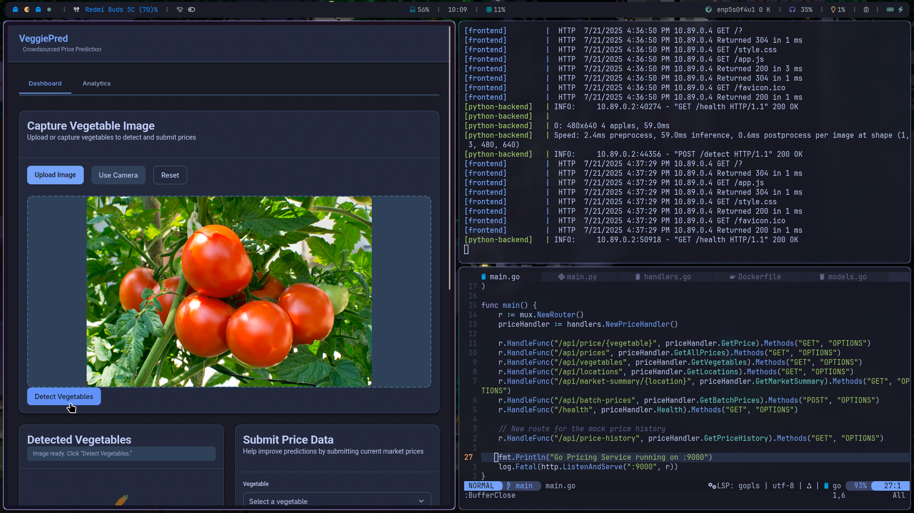
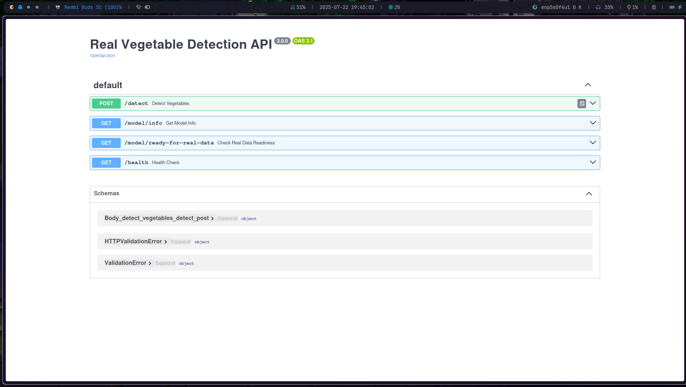
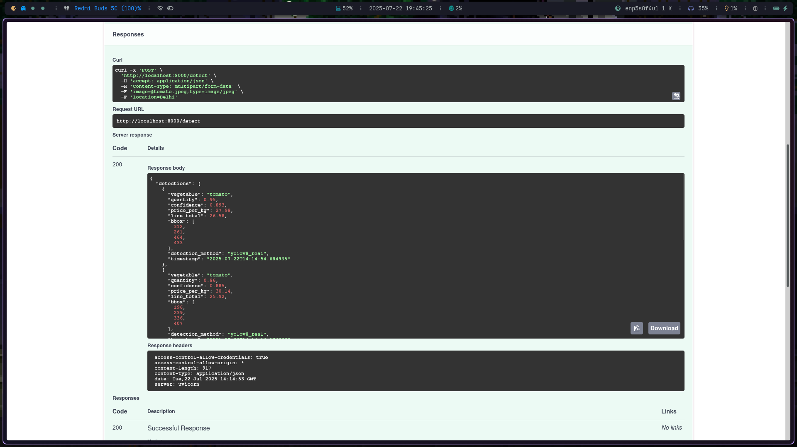
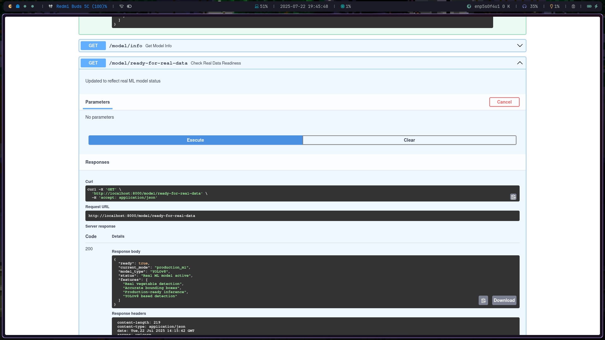

# Vegetable Price Detection Project

<kbd>Demo Video 👇 </kbd>
[](https://youtu.be/GNggxvi5vag)

## Project Overview
A comprehensive solution for detecting vegetables via webcam/mobile camera, retrieving current Indian market prices, calculating totals and enabling community price labelling. The stack uses:

* Front-end: HTML5, CSS3 (custom design system), Vanilla JS
* Python microservice (FastAPI) – image preprocessing, AI detection pipeline, price calc, user contributions, ML price predictions.
* Go microservice (Mux) – ultra-fast read-only price API and write endpoint for contributions.
* Docker / docker-compose – isolates all services.

## Architecture

```text
+-------------+        POST /upload         +-----------------+
|   Frontend  | --------------------------> |      Go API     |
|  (JavaScript)    |                             | (REST with Gin) |
+-------------+                             +-----------------+
       |                                              |
       |                                              |---> [Object Detection] (Go/OpenCV or via Python microservice)
       |                                              |
       |        JSON response w/ boxes, labels        |
       +<---------------------------------------------+
       |
       |--> Display results (bounding boxes etc.)
```
---

## Model APIs
<kbd></kbd>
<kbd></kbd>
<kbd></kbd>

## Repo Structure
```
.
├── docker-compose.yml            # One-command dev/prod deployment
├── vegetable-price-detector/     # Front-end static app
│   ├── index.html
│   ├── style.css
│   └── app.js
└── backend
    ├── python
    │   ├── main.py               # FastAPI root
    │   ├── requirements.txt
    │   ├── utils/
    │   │   └── image_processor.py
    │   ├── services/
    │   │   ├── vegetable_detector.py
    │   │   └── price_service.py
    │   ├── schemas/
    │   │   └── detection_schemas.py
    │   └── Dockerfile
    └── go
        ├── cmd/main.go           # Go entry
        ├── handlers/handlers.go
        ├── models/models.go
        ├── go.mod
        └── Dockerfile
```

## Quick Start
1. Clone repo.
2. `docker compose up --build -d`
3. Visit `http://localhost:8080`.

Python API → `http://localhost:8000/docs` (Swagger)  
Go Price API → `http://localhost:9000/api/prices`


